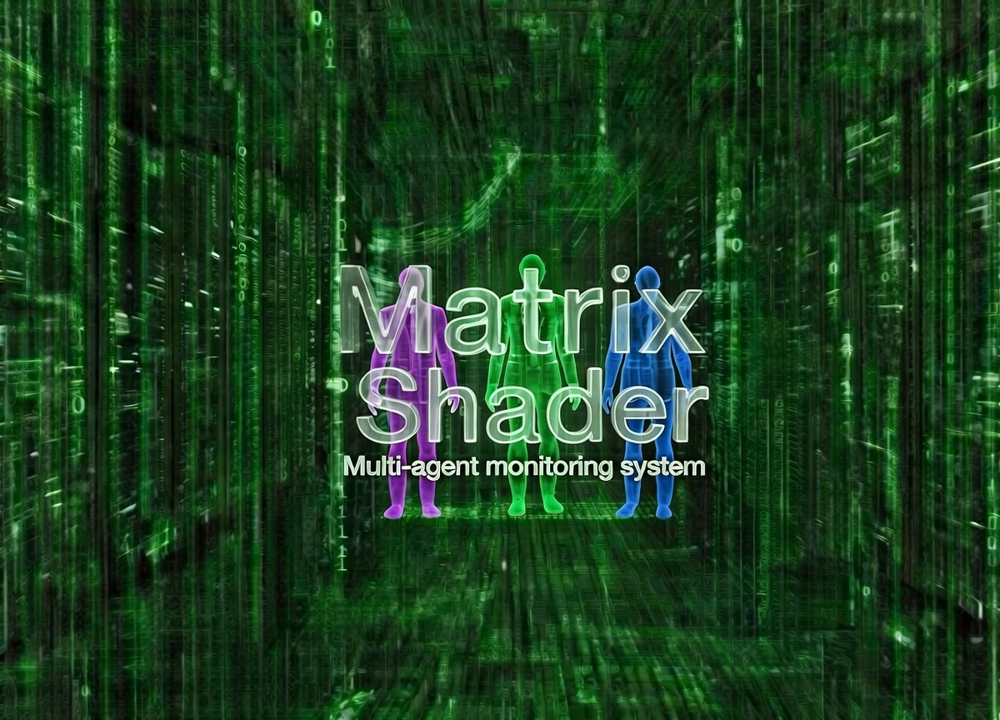
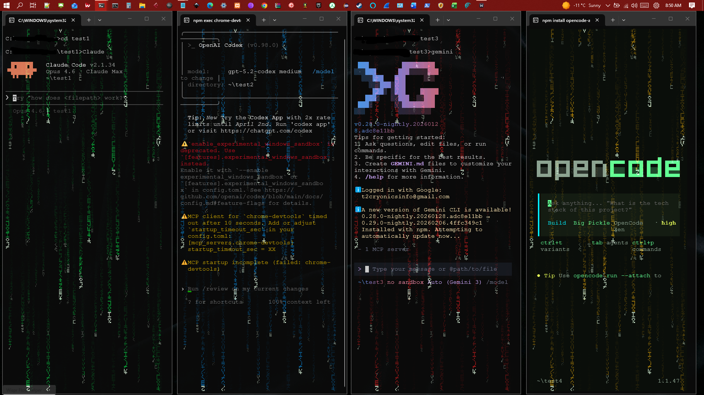
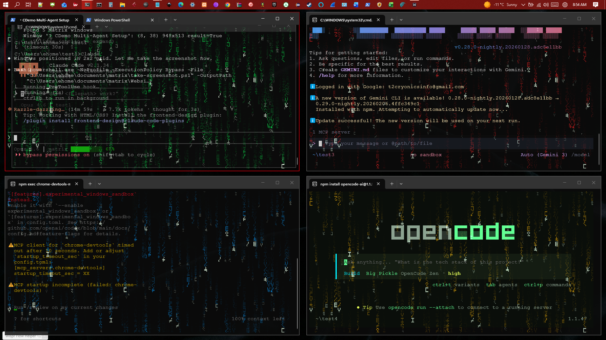

<p align="center">
  
</p>

<p align="center">
  <strong>Real-time GPU-powered Matrix rain for Windows Terminal.</strong><br>
  Multi-window. Color-coded. Built for operators running AI agents.
</p>

<p align="center">
  <a href="https://github.com/matrixshader/matrix-shader/releases/latest"></a>
  <a href="https://github.com/matrixshader/matrix-shader/releases"></a>
  <a href="https://matrixshader.com"></a>
</p>

---

<p align="center">
  
</p>

<p align="center"><em>Four AI agents. Four colors. One simulation.</em></p>

---

## Install

Paste in PowerShell:

```powershell
irm https://matrixshader.com/install.ps1 | iex
```

Or [download the installer](https://github.com/matrixshader/matrix-shader/releases/latest/download/MatrixShaderSetup.exe) directly.

Then:

```
wakeupneo
```

Follow the white rabbit.

## What You Get

**Bluepill (free):**
- Setup wizard, quick-launch, 6 color presets
- Global hotkeys — rotate windows, toggle transparency, swap layouts
- Glitch Snap auto-positioning
- MatrixLite text fallback (no GPU required)

**Redpill ($5 — [Founder's Edition](https://matrixshader.com/redpill)):**
- Full interactive control panel TUI
- Live parameter tuning — speed, glow, width, trail, density
- Custom RGB color picker (any color)
- Per-window depth layer toggles (Far/Mid/Near)
- Multi-tab management, layout modes, Neo vision shader
- Custom hotkey configuration

## Layouts

<p align="center">
  
  
</p>
<p align="center"><em>Pillars &nbsp;&nbsp;&nbsp;&nbsp;&nbsp;&nbsp;&nbsp;&nbsp;&nbsp;&nbsp;&nbsp;&nbsp;&nbsp;&nbsp;&nbsp;&nbsp;&nbsp;&nbsp;&nbsp;&nbsp;&nbsp;&nbsp;&nbsp;&nbsp;&nbsp;&nbsp;&nbsp;&nbsp;&nbsp;&nbsp;&nbsp;&nbsp;&nbsp;&nbsp;&nbsp;&nbsp;&nbsp;&nbsp;&nbsp;&nbsp;&nbsp;&nbsp;&nbsp;&nbsp;&nbsp; Quads</em></p>

Switch with `Ctrl+Shift+L`. Each window gets its own color so you always know which agent is which.

## Commands

| Command | What it does |
|---------|-------------|
| `wakeupneo` | Walk the path — setup wizard |
| `bluepill` | Enter the Matrix — instant launch |
| `redpill` | Control the Matrix — live adjustments |
| `matrixlite` | Text fallback — no GPU needed |

## Hotkeys

| Shortcut | Action |
|----------|--------|
| `Ctrl+Shift+Left/Right` | Rotate windows |
| `Ctrl+Shift+L` | Cycle layout (Pillars/Quads) |
| `Ctrl+Shift+B` | Toggle transparency |
| `Ctrl+Shift+J/K` | Adjust opacity |
| `Ctrl+Shift+H` | Help overlay |

## Requirements

- Windows 10/11
- Windows Terminal (installer sets it up if needed)
- GPU with DirectX 11+ (for shader mode)
- Or any terminal (for MatrixLite text mode)

## The Redpill Protocol

The free version is the real thing — not a demo. But if you want full control over the simulation:

**[matrixshader.com/redpill](https://matrixshader.com/redpill)** — $5 one-time. 3 machines. Yours forever.

Limited to the first 500 operators.

## Support

- [GitHub Issues](https://github.com/matrixshader/matrix-shader/issues) — bugs, feature requests
- [hello@matrixshader.com](mailto:hello@matrixshader.com) — direct line
- [Buy me a coffee](https://buymeacoffee.com/IKnowKungFu) — if it made your terminal cooler

---

**[matrixshader.com](https://matrixshader.com)**

---

Source available under [BSL 1.1](LICENSE). Free for personal and internal use. Auto-converts to MIT on 2030-06-01.

Inspired by The Matrix (1999). Not affiliated with or endorsed by Warner Bros. Entertainment Inc.
If you are a rights holder and are interested in collaboration, please contact: architect@matrixshader.com
